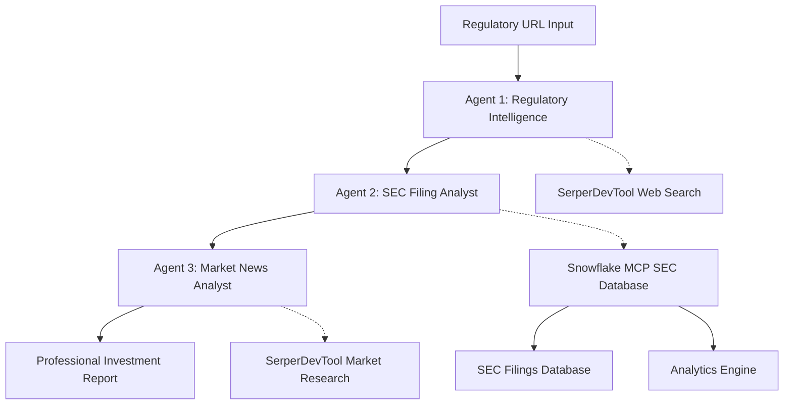

# CrewAI + Snowflake MCP Regulatory Intelligence System

A sophisticated multi-agent system that combines CrewAI's orchestration capabilities with Snowflake's MCP (Model Context Protocol) to analyze regulatory announcements and their potential impact on investment portfolios.

## System Overview

This system demonstrates the powerful combination of:
- **CrewAI**: Multi-agent orchestration with specialized roles
- **Snowflake MCP**: Direct connection to enterprise data warehouses
- **SerperDevTool**: Real-time web search capabilities

### Architecture



The system uses three specialized agents:
- **Regulatory Intelligence Agent**: Analyzes regulatory announcements using web search
- **Portfolio SEC Analyst**: Searches SEC filings using Snowflake MCP for affected companies
- **Market News Analyst**: Researches market sentiment and produces final reports

## Prerequisites

- Python 3.11+
- UV package manager
- Snowflake account with appropriate permissions
- SerperDev API key for web search

**⏱️ Time Investment**: Plan time for initial setup including:
- Snowflake configuration and data setup
- Cortex Search indexing: **Around 49 minutes** (based on my experience with the SEC dataset)
- Testing and validation

## Local Setup Instructions

### 1. Clone and Setup Project

```bash
git clone https://github.com/tonykipkemboi/crewai-mcp-demo.git
cd crewai-mcp-demo/scaffolding_approach_examples/snowflake_mcp_demo

# Install dependencies with UV
uv sync
```

### 2. Environment Configuration

Copy the environment template and configure your credentials:

```bash
cp .env.example .env
```

Edit `.env` with your credentials:

```bash
# Snowflake Configuration
SNOWFLAKE_ACCOUNT=your_account_identifier
SNOWFLAKE_USER=your_username  
SNOWFLAKE_PAT=your_personal_access_token

# SerperDev API for web search
SERPER_API_KEY=your_serper_api_key

# Optional: Gemini API for enhanced LLM capabilities
GEMINI_API_KEY=your_gemini_api_key_here
```

### 3. Snowflake Setup and Configuration

#### Step 3.1: Snowflake Account Setup

1. **Create Snowflake Account**: If you don't have one, sign up at [snowflake.com](https://snowflake.com)

2. **Access Snowsight**: Log into your Snowflake account and navigate to Snowsight (the modern web interface)

3. **Generate Personal Access Token (PAT)**:
   - Go to **Admin** > **Security** > **Key Pair Authentication** 
   - Click **+ Key Pair** to generate a new key pair
   - Save the private key securely - you'll need it for the PAT
   - Create a Personal Access Token using the Snowsight interface
   - Copy the token and save it securely for your `.env` file

#### Step 3.2: SEC Filings Data Setup Using Snowflake Marketplace

**Step 1: Access Snowflake Marketplace**

Navigate to the Snowflake Marketplace in Snowsight to find SEC filings data:


**Step 2: Explore SEC Filings Data**

Once you've obtained SEC filings data, you can explore it in Snowsight:


**Step 3: Set Up Cortex Search for Enhanced Analytics**

Enable Cortex Search to power semantic search capabilities:


**Step 4: Enable Query Tracking**

Enable tracking to monitor performance and usage:


**Step 5: Verify Data Indexing**

Check that your documents are properly indexed:


**💡 Cortex Search Indexing Process**

Snowflake's Cortex Search provides powerful semantic search capabilities for your SEC filings:

- **Indexing Time**: In my testing, the SEC dataset took **approximately 49 minutes** to complete indexing
- **Progress Monitoring**: Track indexing progress in the intuitive Cortex Search interface - simply refresh to see updates
- **Resource Efficiency**: Snowflake's elastic compute automatically scales resources for optimal indexing
- **Incremental Processing**: Start using search capabilities immediately as documents become available during indexing
- **Robust Processing**: The system automatically handles retries and ensures complete indexing

**Best Practices for Optimal Performance**:
- Use dedicated warehouses to leverage Snowflake's workload isolation
- Take advantage of Snowflake's flexible scheduling for off-peak processing
- Monitor usage through Snowsight's comprehensive credit tracking
- Benefit from automatic retry mechanisms for enterprise reliability

#### Step 3.3: Semantic Model Configuration

**What is a Semantic Model and Why Do We Need It?**

A semantic model in Snowflake acts as a **bridge between your raw data and AI agents**. Think of it as a "translator" that helps AI understand:

- **What your data means**: Instead of just seeing column names like `filing_content`, the AI understands this contains "SEC filing text content for regulatory analysis"
- **How to query it**: The model defines optimized SQL patterns for common analysis tasks
- **What metrics matter**: Pre-defined calculations like "regulatory filing frequency" that agents can use directly
- **Business context**: Domain-specific knowledge about SEC filings, regulatory patterns, etc.

**Why This Matters for Our Use Case**:

Without a semantic model, the AI agent would need to:
1. ❌ Guess what each table and column contains
2. ❌ Write complex SQL from scratch for each query
3. ❌ Figure out business logic like "what counts as a regulatory mention"
4. ❌ Understand relationships between different data elements

With our semantic model, the AI agent can:
1. ✅ **Understand the business context** of SEC filings and regulatory analysis
2. ✅ **Use pre-built analytics** like regulatory filing frequency calculations
3. ✅ **Generate optimized queries** based on proven patterns
4. ✅ **Focus on analysis** instead of data structure discovery

**The Configuration File**

The system uses `snowflake_demo_config.yaml` to define how to interact with your Snowflake data:

```yaml
# snowflake_demo_config.yaml
semantic_model:
  # High-level model identification
  name: "SEC_Regulatory_Intelligence"
  description: "Semantic model for analyzing SEC filings for regulatory intelligence"
  
  # Define your data tables - these tell the AI what data is available
  tables:
    - name: "sec_filings_text"
      description: "SEC filing content and metadata for regulatory analysis"
      # This SQL defines what data the AI can access
      sql: "SELECT * FROM MCP_DEMO.PUBLIC.sec_filings_text"
      
  # Pre-built metrics - these are "smart calculations" the AI can use directly
  metrics:
    # This metric helps identify companies with high regulatory exposure
    - name: "regulatory_filing_frequency"
      description: "Count of filings mentioning regulatory topics"
      type: "count"
      # Define what counts as "regulatory content" - customize for your needs
      sql: "filing_content ILIKE '%regulatory%' OR filing_content ILIKE '%FDA%' OR filing_content ILIKE '%SEC%'"
      
    # This metric helps assess disclosure complexity/risk
    - name: "risk_disclosure_intensity" 
      description: "Average length of filing content as risk indicator"
      type: "average"
      # Longer filings often indicate more complex risk disclosures
      sql: "LENGTH(filing_content)"
      
    # This metric helps understand company filing patterns
    - name: "company_filing_count"
      description: "Total number of filings per company"
      type: "count"
      # Count unique documents per company
      sql: "DISTINCT sec_document_id"
```

**Key Configuration Elements Explained**:

1. **Tables Section**: 
   - Tells the AI what data exists and how to access it
   - `sql` field defines the exact query to retrieve data
   - `description` provides business context about the data

2. **Metrics Section**:
   - Pre-built calculations that agents can use immediately
   - Each metric has a `type` (count, average, sum, etc.)
   - The `sql` field defines the business logic for the calculation
   - Descriptions help the AI understand when to use each metric

3. **Customization Tips**:
   - **Add industry-specific keywords** to regulatory_filing_frequency (e.g., add 'GDPR', 'HIPAA' for different sectors)
   - **Create sector-specific metrics** for your portfolio focus areas
   - **Add time-based filters** if you only want recent filings
   - **Include company metadata** like industry classifications for better analysis

**Real-World Example: How This Helps**

Without semantic model, when asked "Find companies affected by FDA drug regulations":
```
❌ Agent struggles with:
- What table contains company data?
- Which column has the company names?
- How do I search for FDA mentions?
- What's the right SQL syntax for this database?
```

With our semantic model, the same query becomes:
```
✅ Agent understands:
- Use the "sec_filings_text" table (from tables definition)
- Search using "regulatory_filing_frequency" metric (pre-built FDA logic)
- Focus on "filing_content" field (defined in table schema)
- Apply business logic automatically (regulatory keywords already defined)
```

Result: **Faster, more accurate analysis** with **consistent business logic** across all queries.

### 4. Agent Configuration

The agents are configured in the `config/` directory:

#### `config/agents.yaml`

```yaml
regulatory_intelligence_agent:
  role: Senior Regulatory Intelligence Analyst
  goal: >
    Analyze regulatory announcements and gather comprehensive intelligence 
    about their potential business and market impacts
  backstory: >
    Expert regulatory analyst with deep knowledge of FDA, SEC, and other 
    regulatory bodies. Specializes in interpreting regulatory language and 
    identifying business implications of new rules and guidance documents.

portfolio_sec_analyst:
  role: Senior Portfolio SEC Filing Analyst  
  goal: >
    Analyze SEC filing patterns to identify companies with regulatory exposure 
    and assess potential risks and opportunities
  backstory: >
    Quantitative analyst specialized in SEC filing analysis. Expert in using 
    database queries to identify regulatory exposure patterns and company 
    risk factors through systematic filing review.

market_news_analyst:
  role: Senior Market Intelligence & News Analyst
  goal: >
    Research current market sentiment and news coverage related to regulatory 
    developments and produce comprehensive investment analysis reports
  backstory: >
    Senior equity research analyst with expertise in regulatory impact analysis. 
    Produces detailed investment research and recommendations based on regulatory 
    developments and market sentiment.
```

#### `config/tasks.yaml`

```yaml
regulatory_intelligence_task:
  description: >
    Analyze the provided regulatory announcement URL and extract key information including:
    - Regulatory body and type of announcement
    - Effective dates and implementation timeline  
    - Affected industries and business activities
    - Potential compliance requirements
    - Market implications and scope of impact
  expected_output: >
    A comprehensive regulatory intelligence briefing with structured analysis 
    of the regulatory development, its scope, timeline, and potential business impacts.
  agent: regulatory_intelligence_agent

portfolio_sec_analysis_task:
  description: >
    Using the regulatory intelligence from the previous analysis, search SEC filings 
    to identify companies that may be affected by this regulatory development. 
    Focus on:
    - Companies in relevant industries or business segments
    - Historical regulatory mentions in filings
    - Risk factor disclosures related to regulatory compliance
    - Quantitative analysis of regulatory exposure patterns
  expected_output: >
    Detailed analysis of specific companies identified through SEC filing searches, 
    including risk assessments, filing patterns, and regulatory exposure metrics.
  agent: portfolio_sec_analyst
  context: [regulatory_intelligence_task]

market_news_analysis_task:
  description: >
    Research current market sentiment, news coverage, and analyst opinions 
    related to the regulatory development and affected companies identified 
    in previous analyses. Produce a final comprehensive investment report with:
    - Market reaction analysis
    - Industry expert opinions  
    - Investment implications and recommendations
    - Risk assessment and monitoring suggestions
  expected_output: >
    Professional investment research report combining regulatory analysis, 
    company-specific impacts, and market intelligence into actionable 
    investment insights and recommendations.
  agent: market_news_analyst
  context: [regulatory_intelligence_task, portfolio_sec_analysis_task]
```

### 5. Running the System

#### Interactive Mode

```bash
# Run the crew interactively
uv run run_crew
```

You'll be prompted to enter:
- **Regulation URL**: Link to the regulatory announcement (e.g., FDA guidance, SEC rule)
- **Portfolio Focus**: Specific industries or company types to focus on

**💡 Pro Tips for Best Results**:
- Use **specific, recent regulation URLs** for more relevant analysis
- Be **specific with portfolio focus** (e.g., "pharmaceutical companies developing cancer drugs" vs. "healthcare")
- Ensure your **Cortex Search indexing is complete** before running analysis
- Have your **SerperDev API key** configured with sufficient quota

#### Example Usage

```bash
# Example input:
Regulation URL: https://www.fda.gov/regulatory-information/search-fda-guidance-documents/development-cancer-drugs-and-use-novel-combination
Portfolio Focus: Pharmaceutical companies, biotech firms
```

**What to Expect During Execution**:

1. **Agent 1 (Regulatory Intelligence)**: 
   - Analyzes the regulation URL using web search
   - Gathers regulatory context and intelligence
   - Outputs structured regulatory analysis

2. **Agent 2 (SEC Filing Analysis)**:
   - Searches through your SEC filings database using Snowflake MCP
   - Progress shown in terminal with MCP server logs
   - May find relevant filings to analyze based on regulatory focus

3. **Agent 3 (Market News Analysis)**:
   - Conducts market research and sentiment analysis
   - Combines previous analysis into final report
   - Generates structured markdown output

**Expected Output Files**:
- `output/portfolio_sec_analysis_task.md` - Detailed SEC analysis
- `output/market_news_analysis_task.md` - Final investment report

#### Programmatic Usage

```python
from src.snowflake_mcp_demo.main import SnowflakeMcpDemo

# Initialize the crew
crew_runner = SnowflakeMcpDemo()

# Run analysis
result = crew_runner.crew().kickoff(inputs={
    'regulation_url': 'https://www.fda.gov/regulatory-information/...',
    'portfolio_focus': 'pharmaceutical companies'
})

print(result)
```

### 6. Understanding the Output

The system generates structured reports in the `output/` directory:

- `portfolio_sec_analysis_task.md`: Detailed SEC filing analysis
- `market_news_analysis_task.md`: Market sentiment and final report

Example output structure:
```markdown
# REGULATORY IMPACT ANALYSIS

## EXECUTIVE SUMMARY
[Key findings and investment thesis]

## REGULATORY OVERVIEW
[Analysis of the regulatory development]

## PORTFOLIO COMPANY ANALYSIS  
### Company Analysis
#### [Company Name] (CIK: [ID])
- Filing Analysis: [Number] total filings, [%] regulatory mentions
- Risk Assessment: [Risk level and reasoning]

## RISK ASSESSMENT MATRIX
| Company | Risk Level | Primary Impact | Time Horizon |
|---------|------------|----------------|--------------|

## INVESTMENT RECOMMENDATIONS
### IMMEDIATE ACTIONS
### MEDIUM-TERM STRATEGY
### LONG-TERM OUTLOOK
```

## Technical Deep Dive

### CrewAI Integration

The system uses CrewAI's `@CrewBase` decorator for structured crew definition:

```python
@CrewBase
class SnowflakeMcpDemo():
    """SnowflakeMcpDemo crew"""
    
    # Snowflake MCP server configuration
    mcp_server_params = [
        StdioServerParameters(
            command="uvx",
            args=[
                "--from", "git+https://github.com/Snowflake-Labs/mcp",
                "mcp-server-snowflake",
                "--service-config-file", str(config_path),
                "--account-identifier", account,
                "--username", username,
                "--pat", pat
            ],
            env={**os.environ}
        )
    ]
```

### Snowflake MCP Tools

The Portfolio SEC Analyst agent receives these MCP tools automatically:

- **SEC_FILINGS_SEARCH**: Semantic search through SEC filings
  - *Powered by your semantic model configuration*
  - Uses Cortex Search for natural language queries
  - Example: "Find pharmaceutical companies mentioning FDA drug regulations"

- **sec_filings_analytics**: Quantitative analysis and metrics
  - *Uses the pre-built metrics from your semantic model*
  - Automatically calculates regulatory exposure scores
  - Example: "Calculate regulatory filing frequency for biotech companies"

**How Semantic Model Powers These Tools**:

1. **When the agent uses SEC_FILINGS_SEARCH**:
   - The search leverages your table definitions to know where to look
   - Business context from descriptions improves search relevance
   - Pre-indexed content from Cortex Search provides fast results

2. **When the agent uses sec_filings_analytics**:
   - Your pre-built metrics become instant calculations
   - No need to write complex SQL for each analysis
   - Consistent business logic across all queries

This is why the semantic model configuration is **crucial** - it transforms generic database tools into **domain-aware regulatory intelligence tools**.

### Data Flow

1. **Input**: Regulatory URL and portfolio focus
2. **Agent 1**: Web search and regulatory analysis
3. **Agent 2**: SEC database search using Snowflake MCP
4. **Agent 3**: Market research and final report generation
5. **Output**: Structured investment analysis report

## Troubleshooting

### Common Issues

**Snowflake Connection Issues**:
```bash
# Test Snowflake connectivity
python -c "
import snowflake.connector
conn = snowflake.connector.connect(
    account='your_account',
    user='your_user',
    password='your_pat'
)
print('Connected successfully')
"
```

**MCP Server Issues**:
```bash
# Test MCP server manually
uvx --from git+https://github.com/Snowflake-Labs/mcp mcp-server-snowflake \
  --service-config-file snowflake_demo_config.yaml \
  --account-identifier your_account \
  --username your_user \
  --pat your_pat
```

**Missing Dependencies**:
```bash
# Reinstall dependencies
uv sync --reinstall
```

### Real-World Performance Notes

**Verified Timing**:
- Cortex Search indexing: **Approximately 49 minutes** (based on our SEC dataset testing)

**Best Practices**:
- **Security**: Rotate Personal Access Tokens periodically following Snowflake's security best practices
- **API Management**: Monitor SerperDev API usage to optimize your quota allocation
- **Performance**: Snowflake handles large SEC filings efficiently - complex queries benefit from proper warehouse sizing
- **Connectivity**: MCP connections are robust - occasional network retries are normal for any distributed system

## Extending the System

### Adding New Agents

1. Define agent in `config/agents.yaml`
2. Add corresponding task in `config/tasks.yaml`
3. Create agent method in `crew.py`:

```python
@agent
def new_agent(self) -> Agent:
    return Agent(
        config=self.agents_config['new_agent'], 
        verbose=True,
        tools=[YourCustomTool()]
    )
```

### Custom Tools Integration

```python
from crewai_tools import BaseTool

class CustomRegulatoryTool(BaseTool):
    name: str = "Custom Regulatory API"
    description: str = "Tool for accessing custom regulatory data"
    
    def _run(self, query: str) -> str:
        # Your custom tool logic
        return "Analysis result"
```

### Different Data Sources

Modify `snowflake_demo_config.yaml` to point to different tables or databases:

```yaml
tables:
  - name: "earnings_calls"
    description: "Earnings call transcripts"
    sql: "SELECT * FROM earnings_data.transcripts"
    
  - name: "news_articles" 
    description: "Financial news articles"
    sql: "SELECT * FROM news_data.articles"
```

## Production Considerations

### Security
- Use Snowflake role-based access control
- Implement API key rotation
- Enable audit logging
- Store PATs securely (they don't expire but should be rotated regularly)

### Performance
- Optimize Snowflake queries with appropriate indexing
- Implement caching for frequently accessed data
- Monitor MCP server performance
- Use dedicated warehouses for heavy SEC filing queries

### Resource Planning

**Snowflake Resource Usage**:
- **Cortex Search indexing**: Leverages Snowflake's elastic compute for efficient indexing based on dataset size
- **Query performance**: Snowflake's columnar architecture optimizes SEC filing searches for fast results
- **Warehouse flexibility**: Dedicated warehouses provide optimal isolation and performance for MCP operations

**API Integration**:
- **SerperDev**: Multiple tiers available to match your usage requirements
- **Gemini API**: Optional integration for enhanced AI analysis capabilities

**Optimization Strategies**:
- Leverage Snowflake's time-travel features to focus on recent filings when appropriate
- Use Snowflake's warehouse scaling for right-sized development and production environments
- Take advantage of result caching to maximize query efficiency
- Utilize Snowsight's detailed usage analytics for optimal resource management

### Monitoring & Analytics
- Track analysis performance metrics using Snowflake's built-in monitoring
- Optimize API usage through comprehensive usage analytics
- Leverage Snowflake's alerting capabilities for proactive system management
- Utilize Snowsight's real-time credit tracking for transparent resource visibility

## Contributing

1. Fork the repository
2. Create a feature branch
3. Make your changes
4. Add tests for new functionality
5. Submit a pull request

## Resources

- [CrewAI Documentation](https://docs.crewai.com)
- [Snowflake MCP Documentation](https://github.com/Snowflake-Labs/mcp)
- [SerperDev API Documentation](https://serper.dev/api-key)

## License

This project is licensed under the MIT License - see the LICENSE file for details.